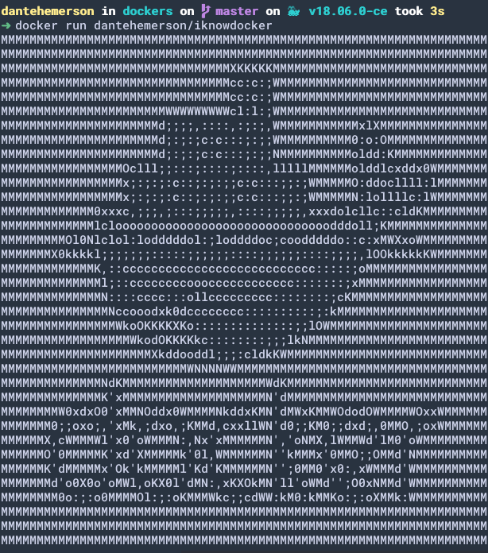

# I Know DOCKER
> My first Docker container.

### About
Convert an image to ASCII image and show it in terminal.


***TO***



### INSTALLATION

Just run:

```
docker run dantehemerson/iknowdocker
```

